# Отчет

ФИО: Ермолаева Елена Александровна

Группа: БПИ224

Вариант: 5

## Условие

__Задача о читателях и писателях.__ Базу данных, представленную массивом целых положительных чисел, разделяют два типа
процессов: N читателей и K писателей. Читатели периодически
просматривают случайные записи базы данных и выводя номер
свой номер (например, PID), индекс записи, ее значение, а также
вычисленное значение числа Фибоначчи. Писатели изменяют случайные записи на случайное число и также выводят информацию о
своем номере, индексе записи, старом значении и новом значении.
Предполагается, что в начале БД находится в непротиворечивом
состоянии (все числа отсортированы, например, по возрастанию).
Каждая отдельная новая запись переводит БД из одного непротиворечивого состояния в другое (то есть, новая сортировка
может
поменять индексы записей или переставить числа). Для предотвращения взаимного влияния транзакций процесс–писатель должен
иметь исключительный доступ к БД. Если к БД не обращается
ни один из процессов–писателей, то выполнять транзакции могут
одновременно сколько угодно читателей.

## 4 - 5 баллов

__Работа cервером__

Читатели и писатели создают TCP-сокеты и подключаются к серверу, который прослушивает входящие подключения.

Взаимодействие между клиентами и сервером:

Читатели генерируют случайный индекс и отправляют запрос на чтение (READ <index>)  на сервер.
Сервер получает запрос, извлекает значение по указанному индексу из массива и отправляет его читателю в формате
VALUE <value>. Читатель, получив значение, вычисляет значение числа Фибоначчи для числа и выводит в
соответствии с заданием.

Писатели отправляют запрос на чтение текущего значения по сгенерированному индексу. Получив значение, они отправляют на
сервер
запрос на запись нового значения в формате (WRITE <index> <new_value>). Сервер получает запрос,
обновляет значение по указанному индексу в базе данных и отправляет подтверждение об обновлении.

### Тесты

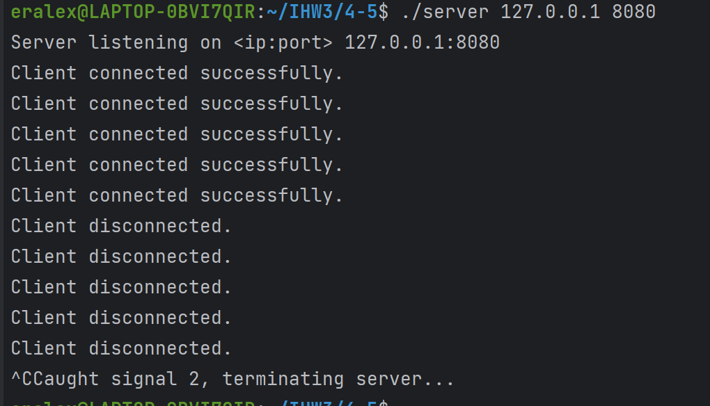

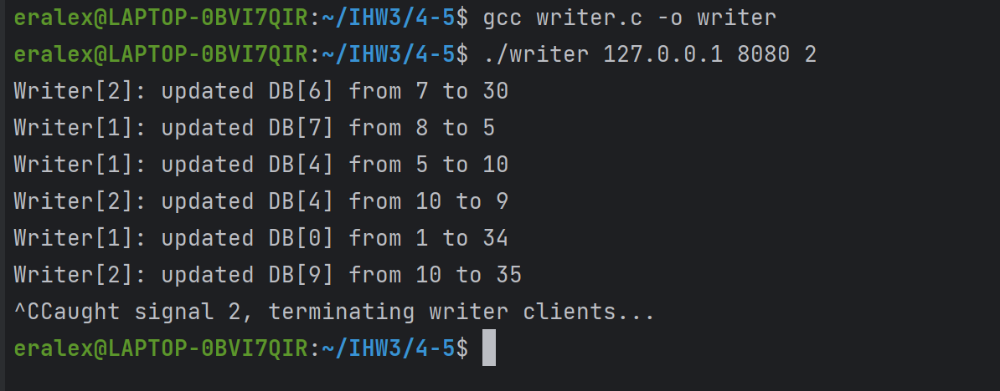

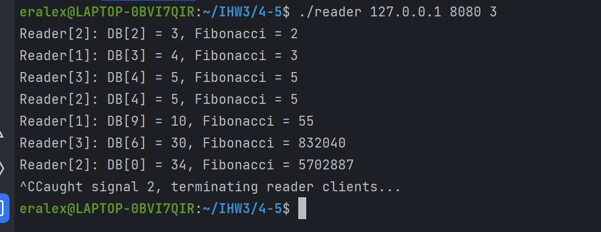

## 6 - 7 баллов

Принцип взаимодействия читателей и писателей с сервером аналогичен на оценку 4-5 за исключением подключения мониторинга
работы сервера

Наблюдатель подключается к серверу, сервер регистрирует наблюдателя посредством получения сообщения "OBSERVER" от
наблюдателя.

Когда сервер обрабатывает запросы от читателей и писателей, он формирует соответствующие сообщения для наблюдателя и
отправляет ему.

__Тест__

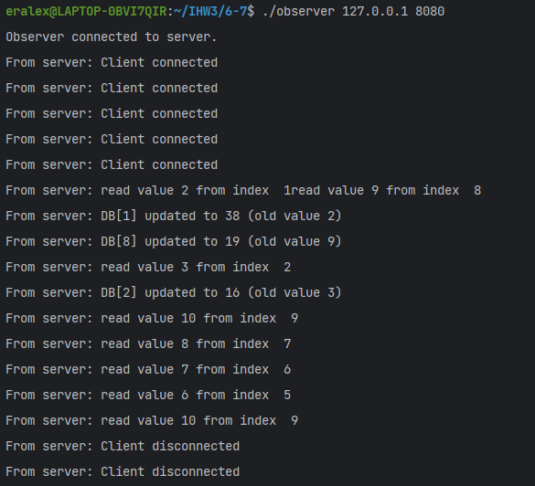

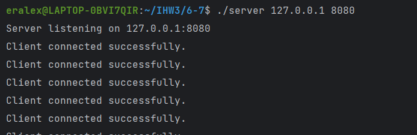

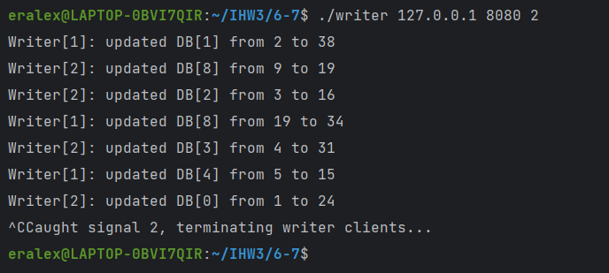

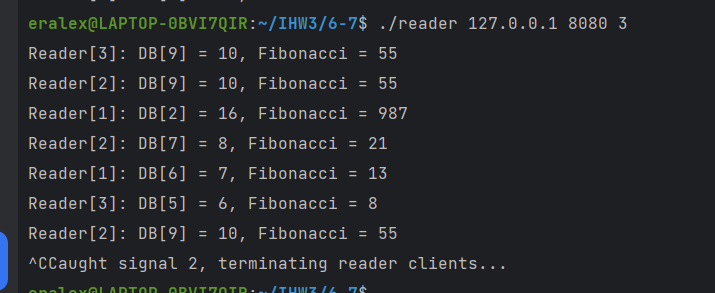

## 8

Сервер хранит сокеты подключенных наблюдателей в массиве. Когда наблюдатель подключается, он отправляет сообщение "
OBSERVER", и сервер добавляет его в
массив наблюдателей. При отправке уведомлений сервер проверяет активность и удаляет отключившихся наблюдателей,
освобождая место для новых подключений. Таким образом, наблюдатели могут подключаться и отключаться в любое время,
обеспечивая непрерывное наблюдение за работой приложения с нескольких независимых компьютеров.

__Тест__

(с несколькими наблюдателями)

1) Подключение 2 наблюдателей

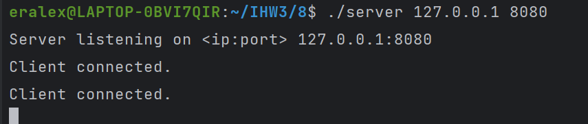

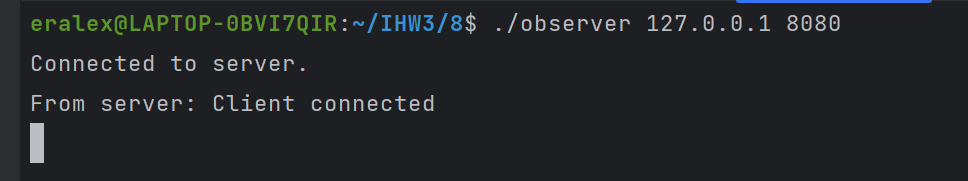

2) Запуск писателей и читателей

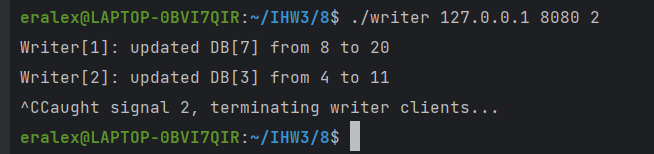

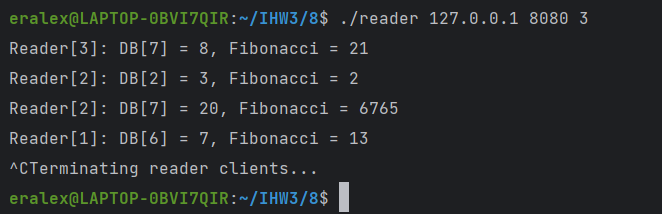

3) Записи с наблюдателей

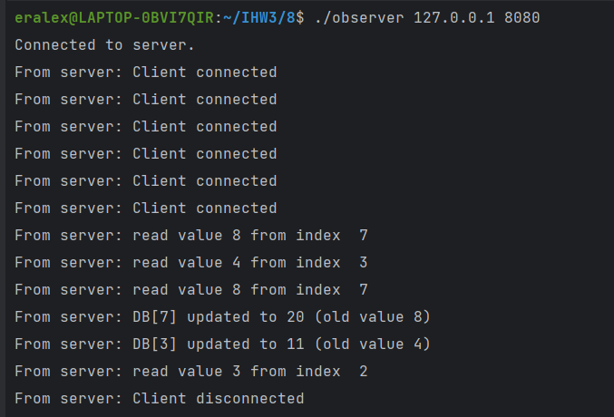

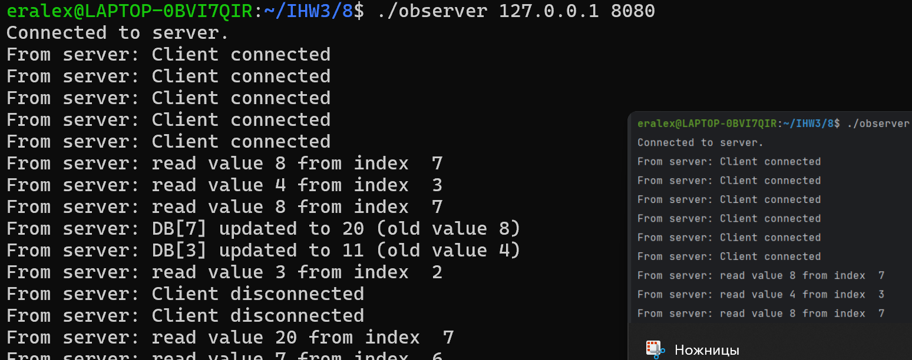

Примечание, по завершении работы сервера, наблюдатели отключаются

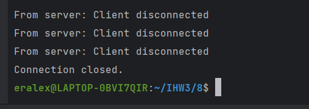

